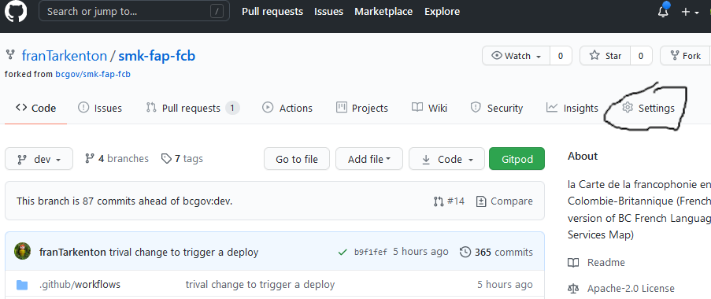
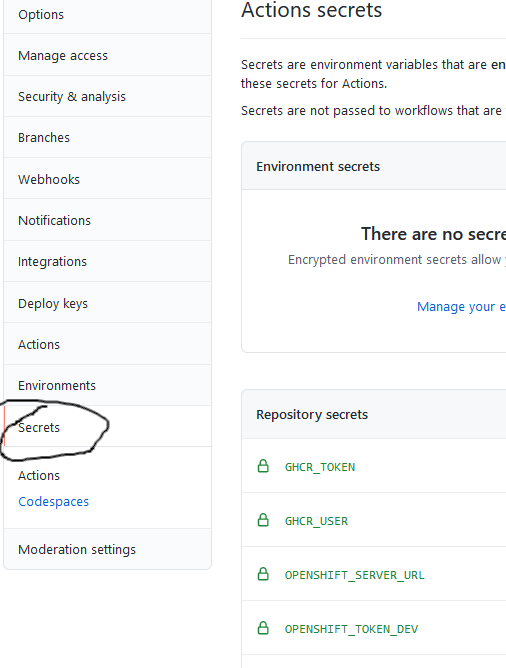

# Adding Secrets

  

[Previous steps have copied github actions into your repository](./addBuildDeployFiles.md). Those actions
are configured to fire on Pull requests to either the 'main' or the 'master'
branches of the repository.

Actions are configured to do nothing unless all the secrets they require to 
communicate with github and openshift exist.

This is the step where we define those secrets, in essence arming
our deployment.

# Details

So go to github and navigate the repository that you want to deploy.
Before you do anything review this checklist:

1. The repository is owned by bcgov
1. DataBC staff are the administrators of the repository.  This is 
   important because we do not want to share the secrets we are putting 
   into the repository with anyone but DBC staff

# Populate Secrets

So to reiterate navigate to the repo in github, click on the repository
settings.  

Once in settings click on secrets

Now at the top right there is button called "New Repository Secret", find it and click on it.

# Secrets to Add

Now add the following secret definitions:

| Secret name | Description |
| ----------- | ------------ | 
| GHCR_TOKEN | The token for this SMK app created with your Github service account. It should include [scopes](https://docs.github.com/en/apps/oauth-apps/building-oauth-apps/scopes-for-oauth-apps) "workflow", "write:packages", and "delete:packages". |
| GHCR_USER | The username that is associated with the github service account |
| OPENSHIFT_SERVER_URL | The url to openshift, this is the same url that is passed when you login to openshift on the command line |
| OPENSHIFT_TOKEN_DEV | The api key for for the service account that is configured in the dev namespace | 
| OPENSHIFT_TOKEN_PROD | The api key for the service account that is configured in the prod namespace |

To find OpenShift tokens, log into OpenShift and look at the ServiceAccounts in both Dev and Prod workspaces. For each, choose an appropriate ServiceAccount. You can find one by looking at Actions output from a deploy in a configured SMK app. Then look at its Secrets (in the ServiceAccount's YAML view) and pick an appropriate Secret - look for "token" in the name. Go to that Secret and copy the value of "token" in its Data.

# Test Your Deploy

After these secrets have been populated you can test your flow by triggering the 
build deploy with a pull request to the master branch. 

It may take a few deploy attempts to shake out issues. When a deploy fails, use deploy output from other SMK apps as reference and compare your deploy output with their output to help diagnose the failure. To retrigger a deploy, close the pull request that triggered it and then reopen it.

# Create a Horizontal Pod Autoscaler

It is recommended to create a Horizontal Pod Autoscaler to more efficiently cope with high demand. Log into OpenShift and find a previously created HPA to use as reference. Create a new HPA referencing the DeploymentConfig created for your SMK app.

[***Back to summary***](./summary.md)
