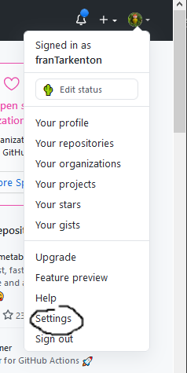
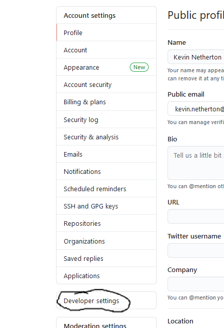
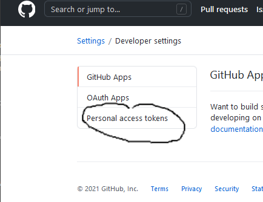
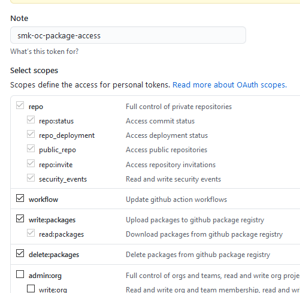

# Overview

The namespace that we set up to host SMK application requires some objects
in order to support the automated build / deploy pattern that has been created
for SMK based apps.

This doc describes what needs to be done to init a namespace so that it can 
support automated build / deploy of SMK based apps.

# Details

here is what you need to do:

1. Acquire a new openshift set of namespaces (dlv|test|prod|tools) - **done**
1. Run the namespace init helm chart - **done**
1. Configure an SMK based app github repo to be deployed to openshift and trigger a build - **done**

# Acquire openshift namespace

This task describes the process of requesting a new openshift namespace from the lab.
The request comes with 4 actual namespaces:

* dev
* test
* prod
* tools

Multiple smk apps will be deployed to the namespace that is acquired in this
step.

# Configure a Github Service Account

SMK app Flow is currently configured to store docker images in github packages.  
Github requires authentication when pulling an image even when its a public image. To
meet that requirement personal access token needs to be configured to allow openshift 
to pull the image from github packages.

To configure a github service account, login to github using that user, then select
user settings...

Next click on Developer settings...

Next select peronal access token

* Finally select **Generate new Token**
* provide a descriptive name for the token something like "smk-oc-package-access"
* Give the Token the following permissions:
    * repo - all permissions
    * workflow
    * write:packages
    * delete:packages

Before you close make sure you have copied the actual token that gets generated.

# Run init helm chart

A smk_namespace helm chart has been created that will add objects to the
namespace that are re-used by each helm chart.

* Github actions service account
* Github actions service account roles
* Github actions service account role bindings
* namespace configmap
* Gateway secrets